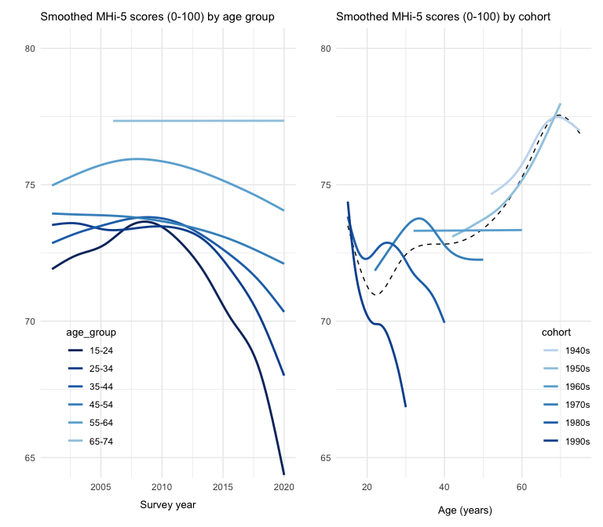
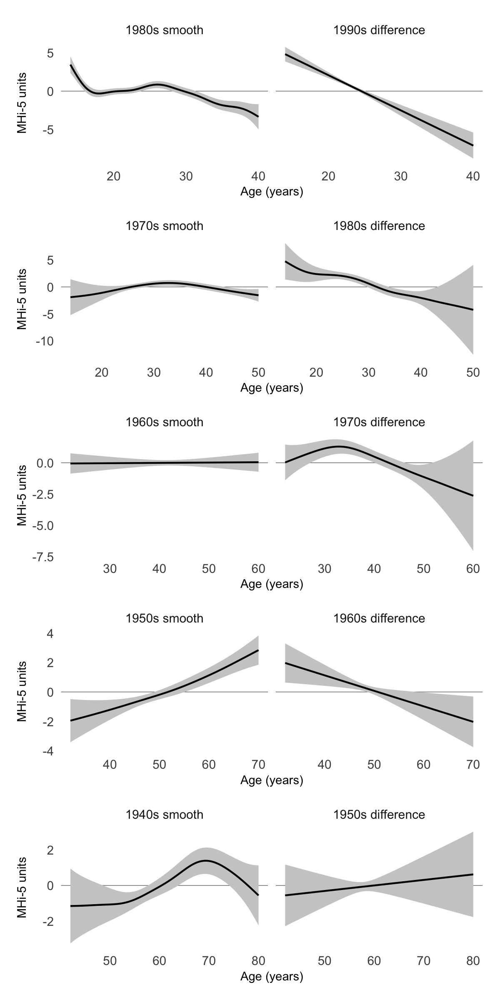
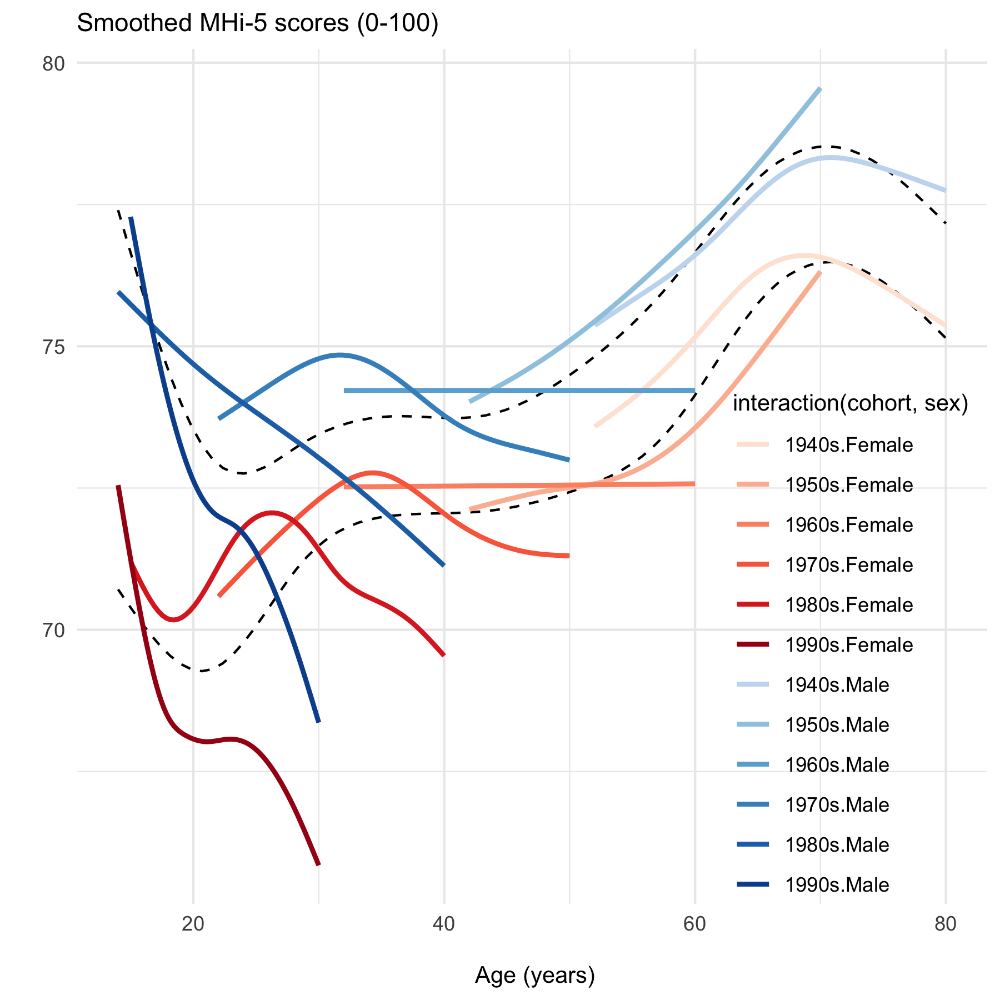
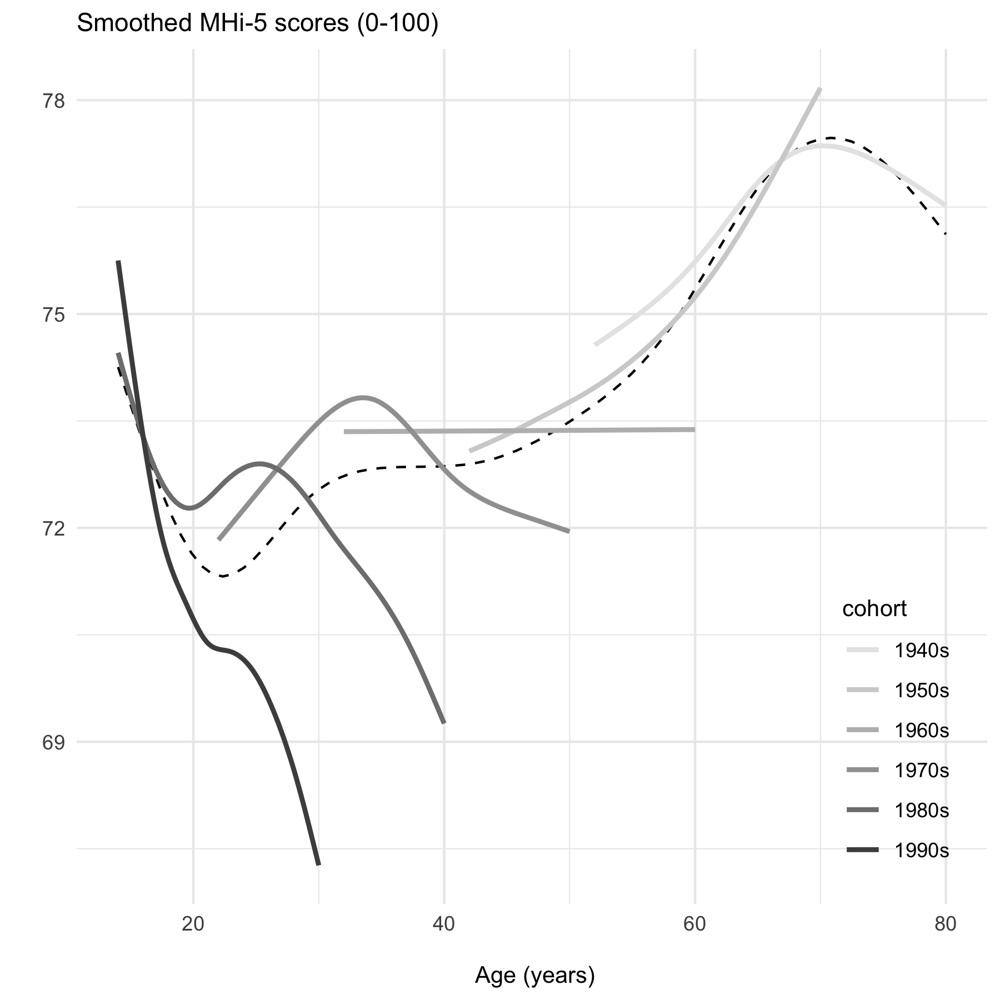
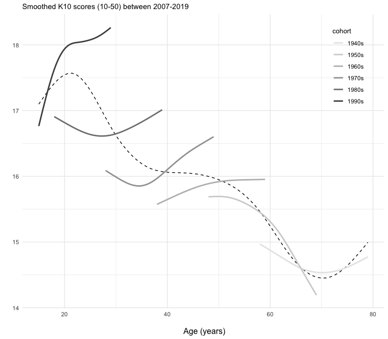
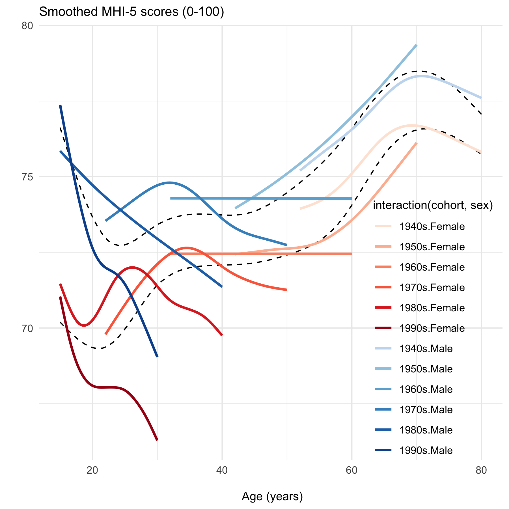
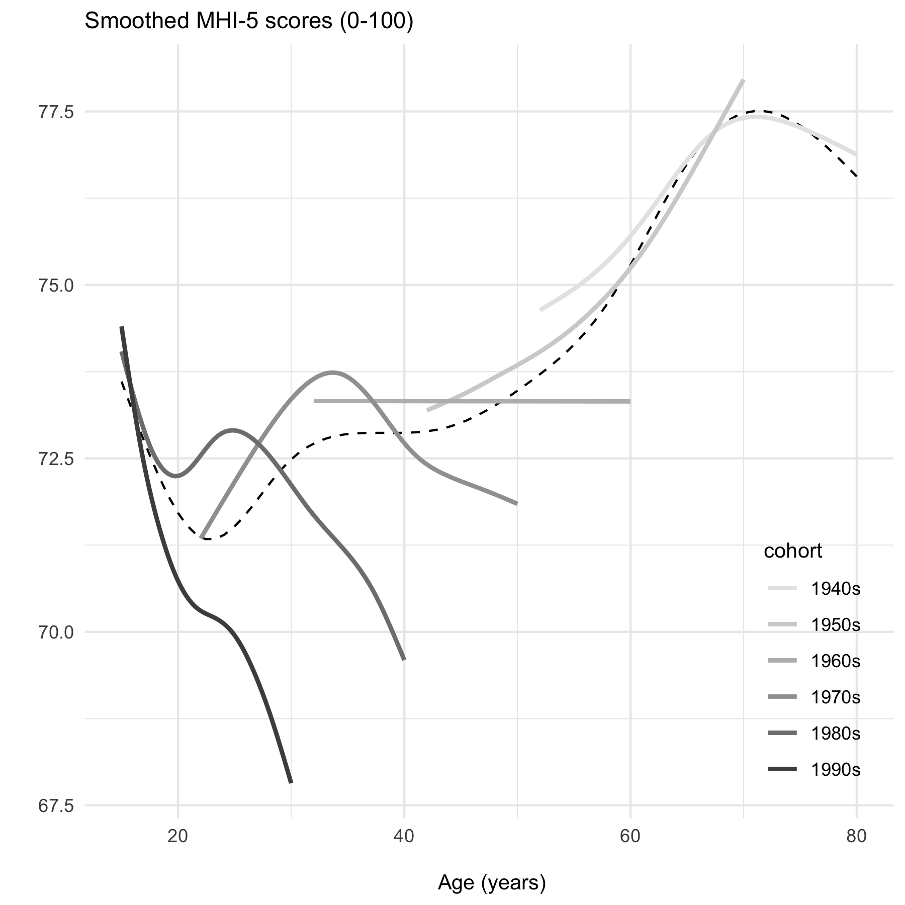
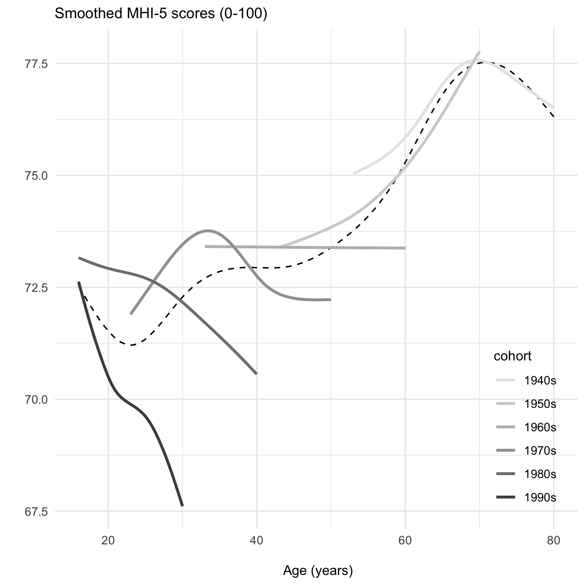

Differential trends in mental health in Australia
================
F Botha1,4, RW Morris1-3, P
Butterworth4,5, N Glozier1,2

 

1.  ARC Centre of Excellence for Children and Families over the Life
    Course
2.  Central Clinical School, Faculty of Medicine and Health, University
    of Sydney, NSW, Australia
3.  School of Psychology, Faculty of Science, University of Sydney, NSW,
    Australia
4.  Melbourne Institute: Applied Economic & Social Research, The
    University of Melbourne, VIC, Australia
5.  National Centre for Epidemiology and Population Health, The
    Australian National University, ACT, Australia

  

 

 

 

Acknowledgement: This research was supported by the Australian
Government through the Australian Research Council’s Centre of
Excellence for Children and Families over the Life Course (Project ID
CE200100025)

  

## Abstract

Given the observed deterioration in mental health among Australians over
the past decade, this study investigates to what extent this differs in
people born in different decades –i.e. possible cohort differences in
mental health among young people in Australia. Using 20 years of data
from the Household, Income and Labour Dynamics in Australia (HILDA)
Survey, we find strong evidence that cohort effects are driving the
declines in mental health. Deteriorating mental health is particularly
pronounced among the 1990s cohort, and seen to a lessor extent among the
1980s cohort. There is little evidence that mental health is worsening
with age for people born prior to the 1980s. The findings from this
study highlight that Millenials are driving the deterioration in
population-level mental health. Understanding the changes in society
that have differentially affected younger people may help ameliorate
this trend, and prevent it continuing for emerging cohorts.

  

  

In many countries there has been an increase in the prevalence of mental
ill health, even prior to COVID, alongside increasing use of both
psychotropics and therapeutic services (Peach et al., 2022). For
instance, the proportion of Australians reporting high or very high
levels of psychological distress has increased year-on-year from 10.8%
in 2011-12 to 15.4% in 2020-21 according to the ABS (Australian Bureau
of Statistics, 2022). This rise in psychological distress was
particularly prevalent among younger age groups, with 18-24 year olds
reporting the largest increase from 11.8% in 2011-12 to 20.1% in
2020-21. These increases are also mirrored in large, longitudinal panel
surveys such as the Household, Income and Labour Dynamics in Australia
(HILDA) Survey (Butterworth, Watson, & Wooden, 2020), as well as the
prevalence of recent mental disorders in focused population-based mental
health surveys, where an increase from 13.4% in 2011-12 to 20.4% in
2020-21, including almost two in five people (39.6%) aged 16-24 has just
been reported (Australian Bureau of Statistics, 2022).

Other OECD countries have observed similar declines in population levels
of mental health, including among young people in the UK, USA,
Netherlands, and Japan (Hidaka, 2012; Nishi, Susukida, Usuda, Mojtabai,
& Yamanouchi, 2018; Ormel, Hollon, Kessler, Cuijpers, & Monroe, 2022;
Twenge, Cooper, Joiner, Duffy, & Binau, 2019), though not all (e.g.,
Canada, Patten et al., 2016). In many cases these changes can be
attributed to changing age structures as the national population grows
(i.e., *age effects*) (Baxter et al., 2014; Ferrari et al., 2013; Vos et
al., 2016), or due to periods of disruption such as the global financial
crisis (GFC) or the COVID-19 pandemic and the loss of economic
opportunity these entail (i.e., *period effects*) (Butterworth, Schurer,
Trinh, Vera-Toscano, & Wooden, 2022; Glozier, Morris, & Schurer, 2022).

Age effects can influence the population-level trends when the
age-structure of the population changes to include more age-groups with
poorer mental health. Comparing age groups over the population has
revealed a U-shaped pattern in mental wellbeing in large cross-sectional
surveys, whereby hedonic aspects of wellbeing decline from young
age-groups (e.g., 18-20) to middle-age (50-55) before increasing to a
peak at 70-75, although there are cultural and national differences
(Steptoe, Deaton, & Stone, 2015; Stone, Schwartz, Broderick, & Deaton,
2010). In Australia, Burns, Butterworth, & Crisp (2020) described
age-related changes in the mental health of Australian adults using 17
years of HILDA data (2001-2017). Using the mental health inventory
(MHI-5), they report only very small differences in mental health over
age-groups, however there was an emerging downward trend for the
youngest (18-24) and very oldest adults (75+) in the more recent years.
Butterworth et al. (2020) has found deteriorating trends in mental
health in Australia. Also using HILDA data, Butterworth et al. (2020)
found an increase in psychological distress (K10 scores) from 4.8% to
7.4% between 2007 to 2017, but only among 18-34 and 35-64 age groups in
this representative longitudinal sample.

Apart from age-related changes, which may reflect normal but temporary
developmental changes in mental health over the life-span, mental health
may also vary by birth cohort. Cohort effects refer to variance over
time that is specific to individuals born in or around certain years
(i.e., generational differences between “millenials” and “baby
boomers”). Cohort differences in mental health are not likely to be
temporary as they are associated with the person-specific differences
which persist over the age-range. Moreover because of the linear
dependency between age-, cohort-, and period-effects (Bell, 2020;
Fienberg & Mason, 1978; Kratz & Brüderl, 2021), correctly disentangling
age-related effects from cohort effects in mental health is fraught, but
crucial if we are to identify the groups most at risk. There is no
technical way to solve the dependency and identify the unique effect of
each in a linear model (Fienberg & Mason, 1978; Holford, 1983; Luo,
2013). Adding covariates changes the model but not the identification
problem. The only way to solve this issue is by fiat; that is by
conceding some constraint whose appropriateness cannot be tested
(Fienberg, 2013; Fienberg & Mason, 1985; Mason & Fienberg, 1985), or by
focusing on nonlinear effects and possibly some interactions (Bell,
2020).

In this paper, we aim to distinguish whether the widely-observed decline
in mental health in Australia is due to variation with age, or
differences between birth cohorts. To remove the linear dependency and
identify any differences in trends between cohorts, we model mental
health (MHI-5 scores) for each cohort as a nonlinear smooth function of
age. Comparisons between smooths allows us to determine whether the
average level of mental health differs between cohorts (controlling for
age), and whether the *trajectory* of mental health (over age) differs
between cohorts.

## Methods

#### Sample selection

The sample included all persons over the age of 14 in the household who
completed the SCQ (Self Completion Questionnaire) in each year. The
birth cohort of each person were defined by the decade of birth year
(1940s, 1950s, 1960s, 1970s, 1980s, 1990s). Thus persons can only
contribute to a single birth cohort, but can be observed multiple times
across survey years/ages. Persons were excluded if they were born prior
to 1940 or after 1999, as after stratification by age they represented
cohorts with sample sizes smaller than desirable for estimation of
penalised nonlinear GAMs. An MHi-5 score was estimated for each
person/year for which there were valid responses on greater than or
equal to half the items, where missing data was replaced with the
average score on the valid items (imputation was performed by HILDA, as
per the planned survey design to minimise attrition and sampling error).
Thus missing scores were excluded on a year-by-person basis. Demographic
details of the sample are provided in the Results in Table 1 below.

    please add any further details about sample selection here  

  

#### Measures

The MHi-5 is a well-validated subset of 5 items from the mental health
component of SF-36 dealing with positive and negative aspects of mental
health (Batterham, Sunderland, Slade, Calear, & Carragher, 2018;
Cuijpers, Smits, Donker, Ten Have, & Graaf, 2009; Ware Jr, 2000; Ware Jr
& Sherbourne, 1992):

1.  “Been a nervous person”
2.  “Felt so down in the dumps nothing could cheer you up”
3.  “Felt calm and peaceful”
4.  “Felt down”
5.  “Been a happy person”

Items were scored to ensure higher scores represented better mental
health.

    if appropriate please add some blurb about how good the MHi-5 is, or how widely used/useful it is in Australia

  

#### Analysis

We estimate penalized smooth trends for each cohort using restricted
maximum likelihood (REML) in a generalized additive mixed modelling
(GAMM) setting, described by Wood et al (Wood, 2004, 2006, 2011; Wood,
Pya, & Säfken, 2016). This is an analogue to a linear multilevel model
with varying intercepts and slopes among the cohorts, but here the
slopes are allowed to “wiggle”. The model includes a global smoothing
term for the effect of age as well as cohort-specific terms, so each
cohort is allowed to have it’s own functional response but the penalty
ensures that functions too far from average are penalized.

Each smoother

is represented by a sum of

simpler, fixed basis functions. The basis functions (splines) were
estimated by quadratically penalized likelihood maximization for
automatic smoothness selection, with a starting value of
.

![\\ \\ \\ \\ y\_{it} = \\beta\_{k}(cohort_i) + f(age\_{it}) + f\_{\[k\]} (age\_{it}) + \\zeta\_{i} + \\epsilon\_{it}](https://latex.codecogs.com/png.image?%5Cdpi%7B110%7D&space;%5Cbg_white&space;%5C%20%5C%20%5C%20%5C%20y_%7Bit%7D%20%3D%20%5Cbeta_%7Bk%7D%28cohort_i%29%20%2B%20f%28age_%7Bit%7D%29%20%2B%20f_%7B%5Bk%5D%7D%20%28age_%7Bit%7D%29%20%2B%20%5Czeta_%7Bi%7D%20%2B%20%5Cepsilon_%7Bit%7D "\ \ \ \ y_{it} = \beta_{k}(cohort_i) + f(age_{it}) + f_{[k]} (age_{it}) + \zeta_{i} + \epsilon_{it}")

")

Where

is the MHI-5 score for each person

over age
;
![\\beta\_{\[k\]}](https://latex.codecogs.com/png.image?%5Cdpi%7B110%7D&space;%5Cbg_white&space;%5Cbeta_%7B%5Bk%5D%7D "\beta_{[k]}")
is the mean MHI-5 estimate for each

birth cohort, after accounting for variations in trend over age; and
![f\_{\[k\]}](https://latex.codecogs.com/png.image?%5Cdpi%7B110%7D&space;%5Cbg_white&space;f_%7B%5Bk%5D%7D "f_{[k]}")
are smooth functions for the trend in MHI-5 scores over age for each
cohort.

The smooth trends were centered for identifiability reasons (Marra &
Wood, 2012; Wood, 2013), however the resulting model estimation allowed
two important comparisons: Firstly the mean MHI-5 estimates
(![\\beta\_{\[k\]}](https://latex.codecogs.com/png.image?%5Cdpi%7B110%7D&space;%5Cbg_white&space;%5Cbeta_%7B%5Bk%5D%7D "\beta_{[k]}"))
provided comparisons for the average difference in mental health between
cohorts. However interpreting these differences is difficult in the
presence of trends over age in each cohort. For example, a mean
difference could be due to a decreasing trend with age in one cohort or
an increasing trend in the other cohort, rather than consistent
differences in mental health over the age range. Thus an important
advantage provided by the current model are the centered
![f\_{\[k\]}](https://latex.codecogs.com/png.image?%5Cdpi%7B110%7D&space;%5Cbg_white&space;f_%7B%5Bk%5D%7D "f_{[k]}")
smooth functions from which differences in trends between cohorts are
directly estimated. The resulting difference smooths are also centered
around zero and so mean differences in mental health are not accounted
for by these smooths, but they will reveal whether mental health is
changing with age in one cohort relative to the other cohort (aka
*reference* cohort). The difference smooths also directly estimate the
uncertainty around the difference, with confidence intervals that
include the uncertainty about the mean difference as well as the
centered smooth itself. This results in intervals with close to nominal
(frequentist) coverage probabilities (Marra & Wood, 2012).

We did not compare cohorts more than a decade apart since there are few
or no overlapping age groups observed, so we restricted ourselves to the
five
()
pairwise comparisons between each cohort and the next oldest cohort
(i.e., the *reference* cohort).

To account for the person-level dependency when survey participants are
measured more than once, we included a first-order autoregressive AR(1)
term

for the residuals based on the unique crosswave ID for each person
,
which is equivalent to including the person-level random intercept

nested within cohort. In sensitivity analyses we explored the influence
of period effects, sex, and first interview, as well as comparisons with
psychological distress. The results are presented in the appendix.

  

## Results

The demographics of each cohort are shown in Table 1 below. Only the
most recent observation from each person is included.

##### Table 1. Demographics stratified by birth cohort

  

Younger cohorts in our sample are more likely to have lower mental
health (MHI-5 score), higher distress, more likely to be single and
unemployed, and less likely to be chronically ill or disabled.

The complete range of ages which includes every observation of every
person in every year included in the final model is shown in the table
below.

##### Table 2. Age distribution by cohort

| cohort | youngest | median | oldest | observations |
|:-------|---------:|-------:|-------:|:-------------|
| 1940s  |       52 |     66 |     80 | 31,871       |
| 1950s  |       42 |     56 |     70 | 43,472       |
| 1960s  |       32 |     46 |     60 | 48,800       |
| 1970s  |       22 |     37 |     50 | 42,379       |
| 1980s  |       15 |     27 |     40 | 45,391       |
| 1990s  |       15 |     21 |     30 | 30,184       |

 

##### Figure 1. Age and cohort effects on mental health over the past two decades

<!-- -->

 

Figure 1 shows changes in mental health scores (MHI-5) in each survey
year by age at time of survey (left panel), and the trends in each birth
cohort as it ages (right panel), where the dotted line represents the
average age effect ignoring cohort. Mental health is worse for younger
age-groups in each survey year and this age-related discrepancy
increases in more recent surveys (left panel), consistent with a cohort
effect. The right panel shows that mental health is worse for younger
generations, where deviations from the dotted line indicate the presence
of a cohort effect. In particular *Millenials* (those born in the 1990s)
have a lower score at the same age as older generations. At age 30 the
average MHI-5 score (on the 0-100 scale) of those born in the 1990s is
about 67, compared to about 72.5 and 74 for people born in the 1980s and
1970s respectively.

Some combinations of ages/years were not observed for all age-groups
(left panel) or cohorts (right panel). For example, people born prior to
1940 were excluded (see methods) and so the earliest year observed for
the oldest age-group (65-74) was 2006, and the left panel shows the
trend line for that age-group does not extend earlier than 2006.
Likewise, the earliest age observed of people born in the 1940s was 52,
and so the trend line for that cohort does not extend earlier than that
age (right panel).

Some trend lines are flat (e.g., left panel, ages 65-74; right panel,
1960s cohort), which is a result of the penalised smoothing spline
determining that no additional degrees of freedom are required to
support curvature in order to explain the variance in that group over
years/ages.

Uncertainty is not quantified (e.g., confidence intervals) in these
plots, but pairwise comparisons of the average difference between each
cohort and the next oldest cohort (reference cohort) is presented below
in Table 3. Moreover, Figure 2 presents the difference smooths for each
pairwise comparison in order to statistically compare the trends over
age between cohorts.

  

##### Table 3. Pairwise differences in average mental health between cohorts

| contrast  | conf.low | estimate | conf.high | p.value |
|:----------|---------:|---------:|----------:|--------:|
| 90s - 80s |   -4.094 |   -3.576 |    -3.059 |   0.000 |
| 80s - 70s |   -2.381 |   -1.603 |    -0.824 |   0.000 |
| 70s - 60s |   -1.594 |   -0.995 |    -0.395 |   0.001 |
| 60s - 50s |   -1.294 |   -0.790 |    -0.287 |   0.002 |
| 50s - 40s |   -1.326 |   -0.738 |    -0.150 |   0.014 |

 

Significant pairwise differences between each cohort and the reference
cohort occurred (*ps* \< .05), indicating lower mental health scores in
the younger cohort of each comparison. These results represent the mean
differences in MHI-5 scores of each cohort, and as such interpreting
these differences is difficult in the presence of trends over age in
each cohort. For example, the mean difference could be due to a
decreasing trend with age in the younger cohort, or an increasing trend
in the older cohort, rather than differences in mental health over all
ages. Paiwise comparisons of the smooth trends over age for each cohort
are presented below.

Figure 2 shows the smooth trend estimates, along with 95%
credible/confidence intervals (which include the uncertainty about the
overall mean as well as the centred smooth itself). In each row the
older cohort is shown in the left column as the ‘reference smooth’, and
the estimated difference between the reference cohort and the cohort
born in the subsequent decade is shown in the right column as the
‘difference smooth’. A signficant difference in trend or slope is
indicated by 95% confidence/credible intervals which exclude zero
(horizonal line) in opposite directions at each endpoint.

##### Figure 2. Centered estimates of cohort trajectories (left) and their differences to the subsequent cohort (right)

<!-- -->

 

The trend in the centered difference smooths (right panels) reveals
whether the *change* in MHI-5 scores or slope of the younger cohort is
significantly different from the slope of the older reference cohort
(left panels) over the same age range, i.e., a cohort effect. For
example a significant negative slope in the right panel demonstrates
MHI-5 scores are declining in the younger cohort at a faster rate than
the reference cohort. However a negative slope in the right panel does
not by itself indicate whether average MHI-5 scores are deteriorating in
that cohort. Inspection of the reference cohort in the left panel is
necessary to determine whether the decline represents a true
deterioration in mental health. For example, the 1990s difference panel
reveals the youngest cohort’s mental health trajectory is significantly
declining with age relative to the 1980s cohort, and the 1980s smooth
(reference in the right panel) is also significantly deteriorating
relative to its own mean baseline. Together this represents evidence
that MHI-5 scores in the 1990s cohort are declining faster than the
deteriorating mental health of the 1980s cohort. Compare to the 1960s
difference smooth in the right panel, where there is also a significant
negative slope however the trend in the 1950s reference smooth (left
panel) is positive, so the negative difference in the right panel is not
due to changes in the 1960s cohort but rather improvements in the 1950s
cohort. In general, no cohort shows a steeper decline relative to its
reference than the 1990s cohort, and when cohorts older than 1990s tend
to decline relative to their older reference cohort (right panels) it is
not due to a deterioration relative to their own mean baseline (left
panels).

The statistical significance of the smooth differences indicates where
the slope in differences between cohorts are non-zero (i.e., positive or
negative). As such they reveal the presence of cohort-effects adjusted
for age. P-values based on Nychka (1988) are shown below.

 

##### Table 4. Approximate significance of smooth differences

| term             | k-index |  edf | F.value | p.value |
|:-----------------|--------:|-----:|--------:|--------:|
| 1990s difference |    0.98 | 1.00 |   60.24 |   0.000 |
| 1980s difference |    1.00 | 4.37 |    8.55 |   0.000 |
| 1970s difference |    1.00 | 3.30 |    6.21 |   0.000 |
| 1960s difference |    1.01 | 1.00 |    3.27 |   0.071 |
| 1950s difference |    1.00 | 1.00 |    0.15 |   0.698 |

 

The p-values indicate that cohort effects exist between each of the
younger cohorts and the next oldest cohort, with the exception of the
1960s cohort difference from the 1950s, and the 1950s difference from
1940s.

  

#### Sensitivity Tests

In addition to the main analysis, we conducted several sensitivity
tests, the results of which are reported in the Appendix. First, we
tested for any gender differences in cohort effects of mental health
(Figure A1). The results are very similar to those reported for the full
sample in Figure 1. The intercepts for men and women are different, with
men’s average mental health being better than women’s average mental
health. However, men and women have similar mental health trajectory
differences between cohorts. Second, in 2011 the HILDA Survey added a
top-up sample of new respondents. This was also around the same time
that we start observing declines in mental health (see Figure 1, left
panel). To ensure that the declining mental health trajectories are not
driven by some unobserved characteristics of the respondents in the
top-up sample, we also conducted the analyses excluding top-sample
members. The results, shown in Figure A2, are similar to those in Figure
1 (right panel) and do not change the cohort trajectories. Third,
instead of the MHI-5, we also applied the Kessler-10 (K10) psychological
distress scale. K10 scores were collected in the HILDA Survey in
alternate years from 2007 to 2019. The corresponding psychological
distress trajectories for each cohort are shown in Figure A3, with
higher K10 scores suggesting greater psychological distress. The
trajectory patterns are consistent with those observed for the MHI-5
scale in Figure 1 (right panel), as psychological distress was higher
for younger cohorts than older cohorts at the same age.

  

## Discussion

Population levels of mental health in Australia have been declining over
the past decade or so. This is especially the case for younger adults
aged between 15 and 35. Although there has been consistent debate about
the possible drivers of these declining mental health trajectories
(Skinner et al., 2022), little work has been done to try and identify
more precisely the source of these patterns.

Using 20 years of longitudinal data we modelled the changes to mental
health over age in Australia in a flexible non-linear model. Our model
allowed us to compare mental health between cohorts, adjusted for age,
and find that the observed deterioration in mental health in Australia
is most consistent with a cohort effect rather than a (temporary)
age-effect. Importantly, it is the youngest cohorts and especially 1990s
birth cohort that is experiencing a decreasing trajectory of mental
health over time. Individuals in this cohort report worse mental health
than older cohorts at the same ages, and because our model allowed us to
project/predict future trajectories on the basis of the current
trajectory, we can expect this decline in the youngest generations to
continue. Thus, the deterioration in mental health over time which has
been reported in large cross-sectional surveys, is likely due to
cohort-specific effects, related to the experience of young people born
in the Millenial generation and may be unlikely to spontaneously
resolve. These findings are similar for men and women, and the results
are robust to alternative samples and measures used.

In comparison to other research on age effects in large population-based
surveys, there are few examples examining mental health but many have
focused on subjective wellbeing evaluated by a single item
life-satisfaction question, also known as *cognitive* wellbeing,
*evaluative* wellbeing or “happiness”. There it has been pointed out
that almost every plausible pattern of age-happiness trajectory has been
reported in the literature (Kratz & Brüderl, 2021), and further shown
the pattern observed depends on the model adopted for analysis. For
instance we employed a random intercept model and observed a U-shaped
effect of age on mental health, and Kratz & Brüderl (2021) showed that
pattern can be produced by a random intercept model which yields biased
age effects due to endogenous selection of happier people with age.
However a sensitivty analysis which controlled for controlled for
endogenous effects by mean centering MHI-5 scores within-person (and
including the mean score as a predictor, Ligthart-Smith, 2016) also
observed a U-shaped pattern in age effects, demonstrating the results we
report here are not biased by endogeneity. An important consideration is
that MHI-5 measures a distinct construct from life-satisfaction (aka
“happiness”), and so represents a distinct psychological construct
(Diener et al., 2017); for instance it has a different time-course in
responses to major life events (Kettlewell et al., 2020). And it is
worth noting that when we examined age-effects on life-satisfaction, we
did not observe cohort specific trajectories as we found with mental
health.

#### Limitations

We did not include major life events in our model because they can act
as mediators that result from age and affect the response (Kettlewell et
al., 2020). We also did not include other potential mediators such as
health status, relationship status, employment status, household income
or region. As such our results should be considered a description of the
*total* effect of age on mental health, rather than any causal
explanation, which is consistent with our aim to describe the
cohort-related differences rather than explain them. Likewise our aim
was not to build a prediction model to extrapolate beyond the range of
data, and instead we prefer to note the expansion of the appropriately
adjusted 95% confidence/credible intervals when estimating future
observations for any particular cohort.

This study is intended as a starting point for more in-depth analysis or
to invigorate other researchers to examine more closely the changes in
mental health happening in Australia in the last decade. Understanding
the exact causes of these patterns, in addition to appropriately
targeted interventions, may be critical if the deteriorating pattern is
to be arrested or shifted.

  

## Appendix

#### Period effects

Period effects refer to variance over time that is common across all age
groups and cohorts, due to population-wide events such as the Global
Financial Crisis (GFC) in 2008 or the COVID-19 pandemic that started in
2020. We estimated the nonlinear effect of period over the complete set
of survey years (2000 to 2020) as a smooth term in a model with cohort
and (smooth) age effects:

![\\ \\ \\ \\ y\_{it} = \\beta\_{k}(cohort_i) + f(age\_{it}) + f\_{\[k\]} (age\_{it}) + f(year_t) + \\zeta\_{i} + \\epsilon\_{it}](https://latex.codecogs.com/png.image?%5Cdpi%7B110%7D&space;%5Cbg_white&space;%5C%20%5C%20%5C%20%5C%20y_%7Bit%7D%20%3D%20%5Cbeta_%7Bk%7D%28cohort_i%29%20%2B%20f%28age_%7Bit%7D%29%20%2B%20f_%7B%5Bk%5D%7D%20%28age_%7Bit%7D%29%20%2B%20f%28year_t%29%20%2B%20%5Czeta_%7Bi%7D%20%2B%20%5Cepsilon_%7Bit%7D "\ \ \ \ y_{it} = \beta_{k}(cohort_i) + f(age_{it}) + f_{[k]} (age_{it}) + f(year_t) + \zeta_{i} + \epsilon_{it}")

")

The centered smooth effect of period (after accounting for nonlinear age
and cohort effects) is shown below.

##### Figure A1. Smoothed effect of period

<!-- -->

 

The results confirmed there was a slow decline in average MHI-5 scores
over the survey period, which we have already seen is not equally shared
by all age-groups or cohorts (e.g,. Figure 1).

After including a smooth term for period we estimated the smooth
trajectory of mental health for each cohort, and in a post-estimation
procedure calculated the difference between cohort smooths in a pairwise
fashion. In contrast to the results reported in Figure 2, these
difference smooths are not directly estimated and so while each
comparison includes overlapping ages, age is not matched exactly in each
pairwise comparison (up to ±5 years lag may be present). Nevertheless
the pattern of differences supports the same inferences drawn from
Figure 2, and demonstrates that period effects are not an influential
presence in the cohort differences we report here.

##### Figure A2. Cohort trajectories (left) and their differences to the subsequent cohort (right)

<!-- -->

  

#### Psychological distress

K10 scores (psychological distress) were collected in alternate years
from 2007 to 2019. The corresponding trajectories for each cohort are
shown below. Psychological distress was higher for younger cohorts than
older cohorts at the same age.

##### Figure A3. Psychological distress (K10 scores)

<!-- -->

  

#### Risk of mental illness

While the MHI-5 is not a diagnostic instrument, it has good psychometric
properties when identifying DSM-V disorders in a community sample (AUC
0.877, Batterham, Sunderland, Slade, Calear, & Carragher, 2018). We used
a cut-off value of 52 to identify people at risk of mental illness and
estimated the prevalence of illness for each age-group and cohort.

##### Figure A4. Age and cohort effects on prevalence of mental illness risk

<!-- -->

 

The prevalence of risk for mental illness varied between age-groups and
cohorts in a similar pattern as psychological distress. Risk was higher
for younger cohorts than older cohorts at the same age.

  

#### Other sensitivity checks

The difference between male and female MHI-5 trajectories is mostly in
the intercept (overall mean level). Men and women have similar
trajectory differences between cohorts.

##### Figure A5. Interaction between sex and cohort

<!-- -->

  

Excluding the Wave 11 top-up sample does not appear to greatly impact
the cohort trajectories.

##### Figure A6. Excluding top-up sample

<!-- -->

  

Excluding the first survey due to social demand characteristics of the
interview process. Note the SF-36 is part of the self-complete
questionniare (SCQ) so no interviewer is present and we expect social
demand characteristics to be low.

##### Figure A7. Excluding first survey

<!-- -->

  

##### Figure A8. Correlated error structure

(not run)

  

## References

Australian Bureau of Statistics. (2022). National
Study of Mental Health and Wellbeing. *ABS*. Retrieved from
<https://www.abs.gov.au/statistics/health/mental-health/national-study-mental-health-and-wellbeing/latest-release>

Batterham, P., Sunderland, M., Slade, T., Calear, A., & Carragher, N.
(2018). Assessing distress in the community: Psychometric properties and
crosswalk comparison of eight measures of psychological distress.
*Psychological Medicine*, *48*(8), 1316–1324.
<https://doi.org/10.1017/S0033291717002835>

Baxter, A. J., Scott, K. M., Ferrari, A. J., Norman, R. E., Vos, T., &
Whiteford, H. A. (2014). Challenging the myth of an “epidemic” of common
mental disorders: Trends in the global prevalence of anxiety and
depression between 1990 and 2010. *Depression and Anxiety*, *31*(6),
506–516. <https://doi.org/10.1002/da.22230>

Bell, A. (2020). Age Period Cohort analysis: A
review of what we should and shouldn’t do. *Annals of Human
Biology*, *47*(2), 208–217.
<https://doi.org/10.1080/03014460.2019.1707872>

Burns, R. A., Butterworth, P., & Crisp, D. A. (2020). Age, sex and
period estimates of Australia’s mental
health over the last 17 years. *Australian & New Zealand Journal of
Psychiatry*, *54*(6), 602–608.
<https://doi.org/10.1177/0004867419888289>

Butterworth, P., Schurer, S., Trinh, T.-A., Vera-Toscano, E., & Wooden,
M. (2022). Effect of lockdown on mental health in Australia: Evidence
from a natural experiment analysing a longitudinal probability sample
survey. *The Lancet Public Health*.
<https://doi.org/10.1016/S2468-2667(22)00082-2>

Butterworth, P., Watson, N., & Wooden, M. (2020). Trends in the
prevalence of psychological distress over time: Comparing results from
longitudinal and repeated cross-sectional surveys. *Frontiers in
Psychiatry*, 1345. <https://doi.org/10.3389/fpsyt.2020.595696>

Cuijpers, P., Smits, N., Donker, T., Ten Have, M., & Graaf, R. de.
(2009). Screening for mood and anxiety disorders with the five-item, the
three-item, and the two-item mental health inventory. *Psychiatry
Research*, *168*(3), 250–255.
<https://doi.org/10.1016/j.psychres.2008.05.012>

Diener, E., Heintzelman, S. J., Kushlev, K., Tay, L., Wirtz, D., Lutes,
L. D., & Oishi, S. (2017). Findings all psychologists should know from
the new science on subjective well-being. *Canadian
Psychology/Psychologie Canadienne*, *58*(2), 87. Retrieved from
<http://psycnet.apa.org/record/2016-48141-001>

Ferrari, A. J., Charlson, F. J., Norman, R. E., Patten, S. B., Freedman,
G., Murray, C. J., … Whiteford, H. A. (2013). Burden of depressive
disorders by country, sex, age, and year: Findings from the global
burden of disease study 2010. *PLoS Medicine*, *10*(11), e1001547.
<https://doi.org/10.1371/journal.pmed.1001547>

Fienberg, S. E. (2013). Cohort analysis’ unholy quest: A discussion.
*Demography*, *50*(6), 1981–1984.
<https://doi.org/10.1007/s13524-013-0251-z>

Fienberg, S. E., & Mason, W. M. (1978). Identification and estimation of
age-period-cohort models in the analysis of discrete archival data.
*Sociological Methodology*, *10*, 1–67. <https://doi.org/10.2307/270764>

Fienberg, S. E., & Mason, W. M. (1985). Specification and implementation
of age, period and cohort models. In *Cohort analysis in social
research* (pp. 45–88). Springer.
<https://doi.org/10.1007/978-1-4613-8536-3_3>

Glozier, N., Morris, R., & Schurer, S. (2022). What happened to the
predicted COVID-19-induced suicide epidemic, and why? *Australian & New
Zealand Journal of Psychiatry*, 00048674221131500.
<https://doi.org/10.1177/00048674221131500>

Hidaka, B. H. (2012). Depression as a disease of modernity: Explanations
for increasing prevalence. *Journal of Affective Disorders*, *140*(3),
205–214. <https://doi.org/10.1016/j.jad.2011.12.036>

Holford, T. R. (1983). The estimation of age, period and cohort effects
for vital rates. *Biometrics*, 311–324.
<https://doi.org/10.2307/2531004>

Kettlewell, N., Morris, R. W., Ho, N., Cobb-Clark, D. A., Cripps, S., &
Glozier, N. (2020). The differential impact of major life events on
cognitive and affective wellbeing. *SSM-Population Health*, *10*,
100533. <https://doi.org/10.1016/j.ssmph.2019.100533>

Kratz, F., & Brüderl, J. (2021). *The age trajectory of happiness*.

Ligthart-Smith, A. (2016). *A comparison of linear mixed models that
include time-varying covariates*. Australian Government Department of
Education and Training.

Luo, L. (2013). Assessing validity and application scope of the
intrinsic estimator approach to the age-period-cohort problem.
*Demography*, *50*(6), 1945–1967.
<https://doi.org/10.1007/s13524-013-0243-z>

Marra, G., & Wood, S. N. (2012). Coverage properties of confidence
intervals for generalized additive model components. *Scandinavian
Journal of Statistics*, *39*(1), 53–74.
<https://doi.org/10.1111/j.1467-9469.2011.00760.x>

Mason, W. M., & Fienberg, S. (1985). *Cohort analysis in social
research: Beyond the identification problem*. Springer Science &
Business Media. <https://doi.org/10.1007/978-1-4613-8536-3_1>

Nishi, D., Susukida, R., Usuda, K., Mojtabai, R., & Yamanouchi, Y.
(2018). Trends in the prevalence of psychological distress and the use
of mental health services from 2007 to 2016 in Japan. *Journal of
Affective Disorders*, *239*, 208–213.
<https://doi.org/10.1016/j.jad.2018.07.016>

Ormel, J., Hollon, S. D., Kessler, R. C., Cuijpers, P., & Monroe, S. M.
(2022). More treatment but no less depression: The treatment-prevalence
paradox. *Clinical Psychology Review*, *91*, 102111.
<https://doi.org/10.1016/j.cpr.2021.102111>

Patten, S. B., Williams, J. V., Lavorato, D. H., Bulloch, A. G., Wiens,
K., & Wang, J. (2016). Why is major depression prevalence not changing?
*Journal of Affective Disorders*, *190*, 93–97.
<https://doi.org/10.1016/j.jad.2015.09.002>

Peach, N., Barrett, E., Cobham, V., Ross, J., Perrin, S., Bendall, S., …
Mills, K. (2022). The mental health of adolescents and young people
experiencing traumatic stress and problematic substance use. *Drug and
Alcohol Review*, *41*, 16–17. <https://doi.org/10.1111/dar.13537>

Steptoe, A., Deaton, A., & Stone, A. A. (2015). Subjective wellbeing,
health, and ageing. *The Lancet*, *385*(9968), 640–648.
<https://doi.org/10.1016/S0140-6736(13)61489-0>

Stone, A. A., Schwartz, J. E., Broderick, J. E., & Deaton, A. (2010). A
snapshot of the age distribution of psychological well-being in the
United States. *Proceedings of the National Academy of Sciences*,
*107*(22), 9985–9990. <https://doi.org/10.1073/pnas.1003744107>

Twenge, J. M., Cooper, A. B., Joiner, T. E., Duffy, M. E., & Binau, S.
G. (2019). Age, period, and cohort trends in mood disorder indicators
and suicide-related outcomes in a nationally representative dataset,
2005–2017. *Journal of Abnormal Psychology*, *128*(3), 185.
<https://doi.org/10.1037/ABN0000410>

Vos, T., Allen, C., Arora, M., Barber, R. M., Bhutta, Z. A., Brown, A.,
… others. (2016). Global, regional, and national incidence, prevalence,
and years lived with disability for 310 diseases and injuries,
1990–2015: A systematic analysis for the Global
Burden of Disease Study 2015. *The Lancet*, *388*(10053),
1545–1602. <https://doi.org/10.1016/S0140-6736(16)31678-6>

Ware Jr, J. E. (2000). SF-36 health survey update. *Spine*, *25*(24),
3130–3139.

Ware Jr, J. E., & Sherbourne, C. D. (1992). The MOS 36-item short-form
health survey (SF-36): I. Conceptual framework and item selection.
*Medical Care*, 473–483.

Wood, S. N. (2004). Stable and efficient multiple smoothing parameter
estimation for generalized additive models. *Journal of the American
Statistical Association*, *99*(467), 673–686.
<https://doi.org/10.1198/016214504000000980>

Wood, S. N. (2006). Low-rank scale-invariant tensor product smooths for
generalized additive mixed models. *Biometrics*, *62*(4), 1025–1036.
<https://doi.org/10.1111/j.1541-0420.2006.00574.x>

Wood, S. N. (2011). Fast stable restricted maximum likelihood and
marginal likelihood estimation of semiparametric generalized linear
models. *Journal of the Royal Statistical Society: Series B (Statistical
Methodology)*, *73*(1), 3–36.
<https://doi.org/10.1111/j.1467-9868.2010.00749.x>

Wood, S. N. (2013). On p-values for smooth components of an extended
generalized additive model. *Biometrika*, *100*(1), 221–228.
<https://doi.org/10.1093/biomet/ass048>

Wood, S. N., Pya, N., & Säfken, B. (2016). Smoothing parameter and model
selection for general smooth models. *Journal of the American
Statistical Association*, *111*(516), 1548–1563.
<https://doi.org/10.1080/01621459.2016.1180986>

