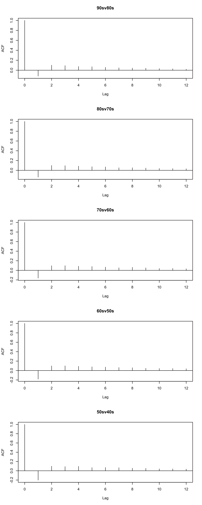

Recent declines in mental health among young adults in Australia
================
F Botha1,4, RW Morris1-3, P
Butterworth4,5, N Glozier1,2

 

1.  ARC Centre of Excellence for Children and Families over the Life
    Course
2.  Central Clinical School, Faculty of Medicine and Health, University
    of Sydney, NSW, Australia
3.  School of Psychology, Faculty of Science, University of Sydney, NSW,
    Australia
4.  Melbourne Institute: Applied Economic & Social Research, The
    University of Melbourne, VIC, Australia
5.  National Centre for Epidemiology and Population Health, The
    Australian National University, ACT, Australia

  

 

 

 

## Abstract

*A study of cohort differences in subjective wellbeing among young
people in Australia*

  

  

  

  

  

  

Recent deterioration in mental health in Australia, especially among
young people, has spurred much speculation around the causes of the
decline and what can be done to arrest it (Skinner, Occhipinti, Song, &
Hickie, 2022). For instance, the proportion of people reporting high or
very high levels of psychological distress in Australia has increased
year-on-year from 10.8% in 2011-12 to 15.4% in 2020-21 according to the
ABS (Australian Bureau of Statistics, 2022). This increase was
particularly prevalent among younger age groups, with 18-24 year olds
reporting the largest increase from 11.8% in 2011-12 to 20.1% in
2020-21. These increases are also mirrored in longitudinal surveys of
mental health such as HILDA (Butterworth, Watson, & Wooden, 2020), as
well as the prevalence of recent mental disorders, which has increased
from 13.4% in 2011-12 to 20.4% in 2020-21, including almost two in five
people (39.6%) aged 16-24.

Other OECD countries have observed similar declines in population levels
of mental health, including among young people (UK, USA, Netherlands,
Japan, see Table 2 in Ormel, Hollon, Kessler, Cuijpers, & Monroe, 2022;
Hidaka, 2012; Nishi, Susukida, Usuda, Mojtabai, & Yamanouchi, 2018), but
not all (e.g., Canada, Patten et al., 2016). In many cases the changes
can be attributable to the overall growth of the global population and
its changing age structure (i.e., *age effects*) (Baxter et al., 2014;
Ferrari et al., 2013; Vos et al., 2016), or loss of economic opportunity
due to periods of disruption such as the GFC or the COVID-19 global
pandemic (i.e., *period effects*) (Butterworth, Schurer, Trinh,
Vera-Toscano, & Wooden, 2022; Glozier, Morris, & Schurer, 2022).

Age effects can influence the population-level trends when mental health
changes over the lifespan as part of normal development/aging and the
age-structure of the population also changes to include more age-groups
with lower mental health. Comparing age groups over the population has
revealed a U-shaped pattern in affective wellbeing (similar to mental
health) in large cross-sectional surveys, whereby hedonic aspects of
wellbeing decline from young age-groups (e.g., 18-20) to middle-age
(50-55) before increasing to a peak at 70-75, although there are
cultural and national differences (Steptoe, Deaton, & Stone, 2015;
Stone, Schwartz, Broderick, & Deaton, 2010). In Australia, Burns,
Butterworth, & Crisp (2020) described the cross-sectional differences in
the mental health of Australian adults using 17 years of HILDA data
(2001-2017). They report only very small differences in mental health
(MHi-5 scores) over age-groups, however there was an emerging downward
trend for the youngest (18-24) and very oldest adults (75+) in the more
recent years (*Their cohort trajectory analysis indicated there is an
improvement in mental health as people age before a substantial decline
after 75 yo, but little evidence of any cohort-specific effects*).

Period effects refer to variance over time that is common across all age
groups, such as due to the COVID-19 global pandemic that took place in
2020-2021. For example in Australia, lockdowns during COVID-19
significantly reduced the mental health of women with children in 2020
(Butterworth et al., 2022; Schurer, Atalay, Glozier, Vera-Toscano, &
Wooden, 2022). However COVID-19 cannot explain the longitudinal trends
in mental health observed before 2020 in Australia. Butterworth et al.
(2020) found an increase in psychological distress (K10 scores) from
4.8% to 7.4% between 2007 to 2017, but only among 18-34 and 35-64 age
groups in a representative longitudinal sample. The GFC in 2008 may
represent a period effect responsible for such a decline, as it appears
restricted to working age people who may be more adversely impacted by
wide-spread changes in economic conditions.

Because mental health changes over time and with age for a variety of
reasons (broadly distinguished so far as age- or period- effects),
locating the source of any varying trend is critical before targeted
interventions can be effective. The evidence reviewed so far indicates
trends in mental health may exist yet comparisons between
cross-sectional and longitudinal studies reveals inconsistencies (e.g.,
Butterworth et al., 2020). Since Fienberg & Mason (1978), social
scientists, demographers and epidemiologists have recognized that a
critical concern is whether the changes observed are due to age-,
period-, or *cohort* effects (e.g., Bell, 2020; Burns et al., 2020;
Fukuda, 2013; Kratz & Brüderl, 2021). Cohort effects refer to variance
over time that is specific to individuals born in or around certain
years (i.e., generational differences between “millenials” and
“boomers”). Because age effects are a linear combination of period
and cohort effects (A = P - C), there is no technical way to solve the
dependency and identify the unique effect of each in a linear model
(Fienberg & Mason, 1978; Holford, 1983; Luo, 2013). Adding covariates to
the linear APC model changes the model but not the identification
problem. The only way to make it go away is by fiat; that is by
conceding some constraint whose appropriateness cannot be tested
(Fienberg, 2013; Fienberg & Mason, 1985; Mason & Fienberg, 1985), or by
focusing on nonlinear effects and possibly some interactions (Bell,
2020).

We set out to distinguish whether the widely-observed decline in mental
health in Australia is due to variation with age, or common effects of
the recent period, or differences between birth cohorts. To identify any
recent period effect, we explicitly modelled mental health (MHi-5
scores) for each age-group as a nonlinear smooth function of time
(year). To identify cohort effects from age effects, we explicitly
modeled mental health for each birthcohort as a nonlinear smooth
function of age. Comparisons between smooths allowed us to determine
where differences between age-groups or cohorts occurred.

  

## Results

This is the main plot showing birth cohort differences in MHi-5 scores.
Mental health (MHi-5) is worse for younger age-groups and even worse
again for more recent younger age groups (left panel) - consistent with
a cohort effect. The right panel shows mental health is worse for
younger generations, particularly *Millenials* born in the 1990s who
have a lower score at the same age as older generations. Uncertainty is
not quantified (e.g., confidence intervals) due to the dependence that
exists within birth cohorts from repeated observations of the same
individuals.

##### Figure 1. Age and cohort effects on mental health

<!-- -->

 

#### Cohort comparisons

We need to compare the smooth trends of each cohort to the next
generation (e.g., 1990s vs 1980s) so as to infer whether the trend is
increasing or decreasing *relative* to the next. We cannot compare
trends from birth cohorts more than two decades apart since there are no
overlapping age groups observed, so we will restrict ourselves to the
five pairwise comparisons between each cohort and the next.

We will use the generalized additive modelling (GAM) method provided by
Wood et al (Wood, 2004, 2006, 2011; Wood, Pya, & Säfken, 2016).

The smooth trends are expressed as spline functions and estimated by
quadratically penalized likelihood maximization for automatic smoothness
selection.

\(\ \ \ \ y_{it} = \alpha(cohort_{[k]}) + f_{[k]} (age_{it}) + \epsilon_{it}\)

\(\ \ \ \ \epsilon \sim N(0, \Delta \sigma^2)\)

Where \(\alpha_{[k]}\) is the mean subjective wellbeing score for each
\(k = 1...K\) cohort, and \(f_{[k]}\) are smooth functions for the trend
in MHi-5 scores over age for each cohort. To account for the
person-level dependency when survey participants are measured more than
once, we included a first-order autoregressive model AR(1) for the
residuals based on the unique crosswave ID for each person
\(i = 1...I\).

The smooth estimates, along with 95% credible/confidence intervals
(which include the uncertainty about the overall mean as well as the
centred smooth itself), are shown below. In each row the older cohort is
shown on the left as the reference smooth, and the estimated difference
between the reference and the younger cohort is shown on the right as
the difference smooth.

##### Figure 2. Centered estimates of cohort trajectories (left) and their differences (right)

<!-- -->

 

The difference smooths (right panels) reveal where the younger cohort is
substantially different from the older reference cohort (left panels)
where the confidence bounds exclude zero (horizontal line) (Marra &
Wood, 2012; Wood, 2013). Inspection of the *1990s difference* panel
reveals the youngest cohort’s wellbeing trajectory is significantly
declining with age relative to the 1980s cohort. After the age of 25, a
person born in the 1990s is expected to have lower subjective wellbeing
than an equivalently aged person born earlier (e.g., 1980s). The other
cohorts also have declining trajectories relative to their reference
(older) cohort, albeit not as substantial a decline and not as reliably
beyond zero as the 1990s cohort. The exception is the 1950s cohort which
has a (non-significantly) increasing trajectory relative to the
reference cohort, consistent with the prevailing view in popular and
social media that the “Baby Boomers” have had a great time at the
expense of the other generations.

  

## Appendix

The difference between male and female MHi-5 trajectories is mostly in
the intercept (overall mean level). Men and women have similar
trajectory differences between cohorts.

##### Figure A1. Interaction between sex and cohort

<!-- -->

 

Excluding the Wave 11 top-up sample does not appear to greatly impact
the cohort trajectories.

##### Figure A2. Excluding top-up sample

<!-- -->

 

K10 scores (psychological distress) were collected in alternate years
from 2007 to 2019. The corresponding trajectories for each cohort are
shown below. Psychological distress was higher for younger cohorts than
older cohorts at the same age.

##### Figure A3. K10 scores (psychological distress)

<!-- -->

 

  

## References

Australian Bureau of Statistics. (2022). National Study of Mental Health
and Wellbeing. *ABS*. Retrieved from
<https://www.abs.gov.au/statistics/health/mental-health/national-study-mental-health-and-wellbeing/latest-release>

Baxter, A. J., Scott, K. M., Ferrari, A. J., Norman, R. E., Vos, T., &
Whiteford, H. A. (2014). Challenging the myth of an “epidemic” of common
mental disorders: Trends in the global prevalence of anxiety and
depression between 1990 and 2010. *Depression and Anxiety*, *31*(6),
506–516. <https://doi.org/10.1002/da.22230>

Bell, A. (2020). Age Period Cohort analysis: A review of what we should
and shouldn’t do. *Annals of Human Biology*, *47*(2), 208–217.
<https://doi.org/10.1080/03014460.2019.1707872>

Burns, R. A., Butterworth, P., & Crisp, D. A. (2020). Age, sex and
period estimates of Australia’s mental health over the last 17 years.
*Australian & New Zealand Journal of Psychiatry*, *54*(6), 602–608.
<https://doi.org/10.1177/0004867419888289>

Butterworth, P., Schurer, S., Trinh, T.-A., Vera-Toscano, E., & Wooden,
M. (2022). Effect of lockdown on mental health in Australia: Evidence
from a natural experiment analysing a longitudinal probability sample
survey. *The Lancet Public Health*.
<https://doi.org/10.1016/S2468-2667(22)00082-2>

Butterworth, P., Watson, N., & Wooden, M. (2020). Trends in the
prevalence of psychological distress over time: Comparing results from
longitudinal and repeated cross-sectional surveys. *Frontiers in
Psychiatry*, 1345. <https://doi.org/10.3389/fpsyt.2020.595696>

Ferrari, A. J., Charlson, F. J., Norman, R. E., Patten, S. B., Freedman,
G., Murray, C. J., … Whiteford, H. A. (2013). Burden of depressive
disorders by country, sex, age, and year: Findings from the global
burden of disease study 2010. *PLoS Medicine*, *10*(11), e1001547.
<https://doi.org/10.1371/journal.pmed.1001547>

Fienberg, S. E. (2013). Cohort analysis’ unholy quest: A discussion.
*Demography*, *50*(6), 1981–1984.
<https://doi.org/10.1007/s13524-013-0251-z>

Fienberg, S. E., & Mason, W. M. (1978). Identification and estimation of
age-period-cohort models in the analysis of discrete archival data.
*Sociological Methodology*, *10*, 1–67. <https://doi.org/10.2307/270764>

Fienberg, S. E., & Mason, W. M. (1985). Specification and implementation
of age, period and cohort models. In *Cohort analysis in social
research* (pp. 45–88). Springer.
<https://doi.org/10.1007/978-1-4613-8536-3_3>

Fukuda, K. (2013). A happiness study using age-period-cohort framework.
*Journal of Happiness Studies*, *14*(1), 135–153.
<https://doi.org/10.1007/s10902-011-9320-4>

Glozier, N., Morris, R., & Schurer, S. (2022). What happened to the
predicted covid-19-induced suicide epidemic, and why? *Australian & New
Zealand Journal of Psychiatry*, 00048674221131500.
<https://doi.org/10.1177/00048674221131500>

Hidaka, B. H. (2012). Depression as a disease of modernity: Explanations
for increasing prevalence. *Journal of Affective Disorders*, *140*(3),
205–214. <https://doi.org/10.1016/j.jad.2011.12.036>

Holford, T. R. (1983). The estimation of age, period and cohort effects
for vital rates. *Biometrics*, 311–324.
<https://doi.org/10.2307/2531004>

Kratz, F., & Brüderl, J. (2021). *The age trajectory of happiness*.

Luo, L. (2013). Assessing validity and application scope of the
intrinsic estimator approach to the age-period-cohort problem.
*Demography*, *50*(6), 1945–1967.
<https://doi.org/10.1007/s13524-013-0243-z>

Marra, G., & Wood, S. N. (2012). Coverage properties of confidence
intervals for generalized additive model components. *Scandinavian
Journal of Statistics*, *39*(1), 53–74.
<https://doi.org/10.1111/j.1467-9469.2011.00760.x>

Mason, W. M., & Fienberg, S. (1985). *Cohort analysis in social
research: Beyond the identification problem*. Springer Science &
Business Media. <https://doi.org/10.1007/978-1-4613-8536-3_1>

Nishi, D., Susukida, R., Usuda, K., Mojtabai, R., & Yamanouchi, Y.
(2018). Trends in the prevalence of psychological distress and the use
of mental health services from 2007 to 2016 in Japan. *Journal of
Affective Disorders*, *239*, 208–213.
<https://doi.org/10.1016/j.jad.2018.07.016>

Ormel, J., Hollon, S. D., Kessler, R. C., Cuijpers, P., & Monroe, S. M.
(2022). More treatment but no less depression: The treatment-prevalence
paradox. *Clinical Psychology Review*, *91*, 102111.
<https://doi.org/10.1016/j.cpr.2021.102111>

Patten, S. B., Williams, J. V., Lavorato, D. H., Bulloch, A. G., Wiens,
K., & Wang, J. (2016). Why is major depression prevalence not changing?
*Journal of Affective Disorders*, *190*, 93–97.
<https://doi.org/10.1016/j.jad.2015.09.002>

Schurer, S., Atalay, K., Glozier, N., Vera-Toscano, E., & Wooden, M.
(2022). Zero-COVID Policies: Melbourne’s 112-day hard lockdown
experiment harmed mostly mothers. *medRxiv*.
<https://doi.org/10.1101/2022.01.30.22270130>

Skinner, A., Occhipinti, J.-A., Song, Y. J. C., & Hickie, I. B. (2022).
Population mental health improves with increasing access to treatment:
Evidence from a dynamic modelling analysis. *BMC Psychiatry*, *22*(1),
1–11. <https://doi.org/10.1186/s12888-022-04352-w>

Steptoe, A., Deaton, A., & Stone, A. A. (2015). Subjective wellbeing,
health, and ageing. *The Lancet*, *385*(9968), 640–648.
<https://doi.org/10.1016/S0140-6736(13)61489-0>

Stone, A. A., Schwartz, J. E., Broderick, J. E., & Deaton, A. (2010). A
snapshot of the age distribution of psychological well-being in the
United States. *Proceedings of the National Academy of Sciences*,
*107*(22), 9985–9990. <https://doi.org/10.1073/pnas.1003744107>

Vos, T., Allen, C., Arora, M., Barber, R. M., Bhutta, Z. A., Brown, A.,
… others. (2016). Global, regional, and national incidence,
prevalence, and years lived with disability for 310 diseases and
injuries, 1990–2015: A systematic analysis for the Global Burden of
Disease Study 2015. *The Lancet*, *388*(10053), 1545–1602.
<https://doi.org/10.1016/S0140-6736(16)31678-6>

Wood, S. N. (2004). Stable and efficient multiple smoothing parameter
estimation for generalized additive models. *Journal of the American
Statistical Association*, *99*(467), 673–686.
<https://doi.org/10.1198/016214504000000980>

Wood, S. N. (2006). Low-rank scale-invariant tensor product smooths for
generalized additive mixed models. *Biometrics*, *62*(4), 1025–1036.
<https://doi.org/10.1111/j.1541-0420.2006.00574.x>

Wood, S. N. (2011). Fast stable restricted maximum likelihood and
marginal likelihood estimation of semiparametric generalized linear
models. *Journal of the Royal Statistical Society: Series B (Statistical
Methodology)*, *73*(1), 3–36.
<https://doi.org/10.1111/j.1467-9868.2010.00749.x>

Wood, S. N. (2013). On p-values for smooth components of an extended
generalized additive model. *Biometrika*, *100*(1), 221–228.
<https://doi.org/10.1093/biomet/ass048>

Wood, S. N., Pya, N., & Säfken, B. (2016). Smoothing parameter and model
selection for general smooth models. *Journal of the American
Statistical Association*, *111*(516), 1548–1563.
<https://doi.org/10.1080/01621459.2016.1180986>

