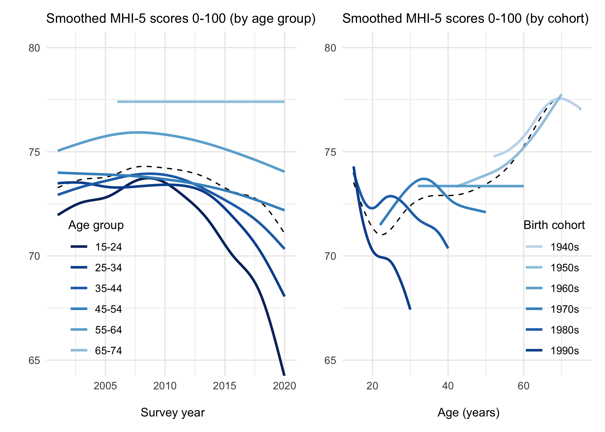
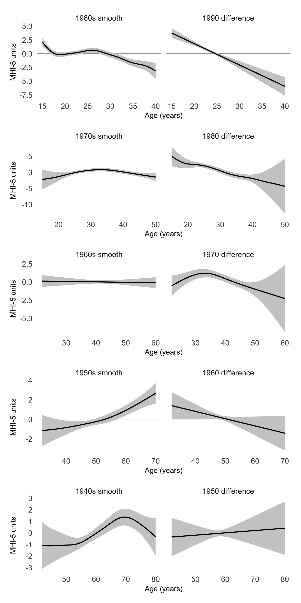

Differential trends in mental health in Australia
================
F Botha<sup>1,4</sup>, RW Morris<sup>1-3</sup>, P
Butterworth<sup>4,5</sup>, N Glozier<sup>1,2</sup>

 

1.  ARC Centre of Excellence for Children and Families over the Life
    Course
2.  Central Clinical School, Faculty of Medicine and Health, University
    of Sydney, NSW, Australia
3.  School of Psychology, Faculty of Science, University of Sydney, NSW,
    Australia
4.  Melbourne Institute: Applied Economic & Social Research, The
    University of Melbourne, VIC, Australia
5.  National Centre for Epidemiology and Population Health, The
    Australian National University, ACT, Australia

<br><br>

 

 

 

Acknowledgement: This research was supported by the Australian
Government through the Australian Research Council’s Centre of
Excellence for Children and Families over the Life Course (Project ID
CE200100025)

<br><br>

## README

This README describes the data and main analysis used in the paper
titled “The kids are not ok: Differential trends in mental health in
Australia”. Data preprocessing, import, figure construction and results
are shown below.

<br><br>

## Project layout

The folder structure and file location of the code used in the project
is described below.

\|– README this file  
\|  
\|  
\|– data/ *(data required for project, i.e., inputs))*  
\|  
\|  
\|– docs/ *(written/text generated by project, i.e., outputs)*  
\|  
\|  
\|– figures/ *(plots and figures generated by project, i.e., outputs)*  
\|  
\|  
\|– results/ *(data generated by project, i.e., outputs)*  
\|  
\|  
\|– src/ *(scripts to generate outputs)*  
\|–– preprocessing.R

<br><br>

## Import data

Data were obtained by application from the Australian Government
Department of Social Services Dataverse website:
<https://www.dss.gov.au/about-the-department/longitudinal-studies/living-in-australia-hilda-household-income-and-labour-dynamics-in-australia-overview>

After application was approved, we downloaded the combined dataset from
the following 20 files:

    ##  [1] "Combined_a200c.dta" "Combined_b200c.dta" "Combined_c200c.dta"
    ##  [4] "Combined_d200c.dta" "Combined_e200c.dta" "Combined_f200c.dta"
    ##  [7] "Combined_g200c.dta" "Combined_h200c.dta" "Combined_i200c.dta"
    ## [10] "Combined_j200c.dta" "Combined_k200c.dta" "Combined_l200c.dta"
    ## [13] "Combined_m200c.dta" "Combined_n200c.dta" "Combined_o200c.dta"
    ## [16] "Combined_p200c.dta" "Combined_q200c.dta" "Combined_r200c.dta"
    ## [19] "Combined_s200c.dta" "Combined_t200c.dta"

Data preprocessing was performed as described in
`import-and-preprocessing.R`

The following libraries are required to perform the main analysis and
create figures 1 & 2.

The MHI-5 data along with age and unique (crosswave) person IDs were
imported for the main analysis and transformed to create age-group and
cohort variables.

``` r
hilda.data <- read_rds("data/preprocessed.RDS") %>% 
  select(xwaveid, year, age, ghmh) %>%
  filter(ghmh > 0) %>% # select valid MHI-5 values
  mutate(
    age_group = case_when(
      age <= 14 ~ "0-14",  # there is n = 1 fourteen year old
      age <= 24 ~ "15-24", 
      age <= 34 ~ "25-34",
      age <= 44 ~ "35-44",
      age <= 54 ~ "45-54",
      age <= 65 ~ "55-64",
      age <= 75 ~ "65-74",
      age <= 85 ~ "75-84",
      TRUE      ~ "85+"),
    birthyear = year - age,
    cohort = case_when(
      birthyear %in% 1900:1929 ~ "1920s",
      birthyear %in% 1930:1939 ~ "1930s", 
      birthyear %in% 1940:1949 ~ "1940s",
      birthyear %in% 1950:1959 ~ "1950s",
      birthyear %in% 1960:1969 ~ "1960s",
      birthyear %in% 1970:1979 ~ "1970s",
      birthyear %in% 1980:1989 ~ "1980s",
      birthyear %in% 1990:1999 ~ "1990s",
      birthyear %in% 2000:2009 ~ "2000s", 
      birthyear %in% 2010:2020 ~ "2010s", 
      TRUE ~ "problem"
    )) %>%
  mutate(xwaveid = factor(xwaveid),
         ocohort = ordered(cohort))
```

| xwaveid | year | age | ghmh | age_group | birthyear | cohort | ocohort |
|:--------|-----:|----:|-----:|:----------|----------:|:-------|:--------|
| 0100001 | 2001 |  49 |   72 | 45-54     |      1952 | 1950s  | 1950s   |
| 0100001 | 2002 |  50 |   84 | 45-54     |      1952 | 1950s  | 1950s   |
| 0100001 | 2003 |  51 |   88 | 45-54     |      1952 | 1950s  | 1950s   |
| 0100001 | 2004 |  52 |   88 | 45-54     |      1952 | 1950s  | 1950s   |
| 0100002 | 2001 |  49 |   64 | 45-54     |      1952 | 1950s  | 1950s   |
| 0100002 | 2002 |  50 |   76 | 45-54     |      1952 | 1950s  | 1950s   |
| 0100002 | 2003 |  51 |   72 | 45-54     |      1952 | 1950s  | 1950s   |
| 0100002 | 2004 |  52 |   68 | 45-54     |      1952 | 1950s  | 1950s   |
| 0100003 | 2001 |  49 |   92 | 45-54     |      1952 | 1950s  | 1950s   |
| 0100003 | 2002 |  50 |   84 | 45-54     |      1952 | 1950s  | 1950s   |

-   `ghmh` is the MHI-5 score for each person in each year (0-100)
-   `xwaveid` is the unique crosswave ID for each person to link records
    across years/waves
-   `ocohort` is an ordered factor variable, which is a prerequisite to
    estimate difference smooths in **mgcv**

<br><br>

## Analysis

We estimate penalized smooth trends for each cohort using restricted
maximum likelihood (REML) in a generalized additive mixed modelling
(GAMM) setting, described by Wood et al (Wood, 2004, 2006, 2011; Wood,
Pya, & Säfken, 2016). This is an analogue to a linear multilevel model
with varying intercepts and slopes among the cohorts, but here the
slopes are allowed to “wiggle”. The model includes a global smoothing
term for the effect of age as well as cohort-specific terms, so each
cohort is allowed to have it’s own functional response but the penalty
ensures that functions too far from average are penalized.

Each smoother

is represented by a sum of

simpler, fixed basis functions. The basis functions (splines) were
estimated by quadratically penalized likelihood maximization for
automatic smoothness selection, with a starting value of
.

![\\ \\ \\ \\ y\_{it} = \\beta\_{k}(cohort_i) + f(age\_{it}) + f\_{\[k\]} (age\_{it}) + \\zeta\_{i} + \\epsilon\_{it}](https://latex.codecogs.com/png.image?%5Cdpi%7B110%7D&space;%5Cbg_white&space;%5C%20%5C%20%5C%20%5C%20y_%7Bit%7D%20%3D%20%5Cbeta_%7Bk%7D%28cohort_i%29%20%2B%20f%28age_%7Bit%7D%29%20%2B%20f_%7B%5Bk%5D%7D%20%28age_%7Bit%7D%29%20%2B%20%5Czeta_%7Bi%7D%20%2B%20%5Cepsilon_%7Bit%7D "\ \ \ \ y_{it} = \beta_{k}(cohort_i) + f(age_{it}) + f_{[k]} (age_{it}) + \zeta_{i} + \epsilon_{it}")

")

Where

is the MHI-5 score for each person

over age
;
![\\beta\_{\[k\]}](https://latex.codecogs.com/png.image?%5Cdpi%7B110%7D&space;%5Cbg_white&space;%5Cbeta_%7B%5Bk%5D%7D "\beta_{[k]}")
is the mean MHI-5 estimate for each

birth cohort, after accounting for variations in trend over age; and
![f\_{\[k\]}](https://latex.codecogs.com/png.image?%5Cdpi%7B110%7D&space;%5Cbg_white&space;f_%7B%5Bk%5D%7D "f_{[k]}")
are smooth functions for the trend in MHI-5 scores over age for each
cohort.

The smooth trends were centered for identifiability reasons (Marra &
Wood, 2012; Wood, 2013), however the resulting model estimation allowed
two important comparisons: Firstly the mean MHI-5 estimates
(![\\beta\_{\[k\]}](https://latex.codecogs.com/png.image?%5Cdpi%7B110%7D&space;%5Cbg_white&space;%5Cbeta_%7B%5Bk%5D%7D "\beta_{[k]}"))
provided comparisons for the average difference in mental health between
cohorts. However interpreting these differences is difficult in the
presence of trends over age in each cohort. For example, a mean
difference could be due to a decreasing trend with age in one cohort or
an increasing trend in the other cohort, rather than consistent
differences in mental health over the age range. Thus an important
advantage provided by the current model are the centered
![f\_{\[k\]}](https://latex.codecogs.com/png.image?%5Cdpi%7B110%7D&space;%5Cbg_white&space;f_%7B%5Bk%5D%7D "f_{[k]}")
smooth functions from which differences in trends between cohorts are
directly estimated. The resulting difference smooths are also centered
around zero and so mean differences in mental health are not accounted
for by these smooths, but they will reveal whether mental health is
changing with age in one cohort relative to the other cohort (aka
*reference* cohort). The difference smooths also directly estimate the
uncertainty around the difference, with confidence intervals that
include the uncertainty about the mean difference as well as the
centered smooth itself. This results in intervals with close to nominal
(frequentist) coverage probabilities (Marra & Wood, 2012).

We did not compare cohorts more than a decade apart since there are few
or no overlapping age groups observed, so we restricted ourselves to the
five
()
pairwise comparisons between each cohort and the next oldest cohort
(i.e., the *reference* cohort).

To account for the person-level dependency when survey participants are
measured more than once, we included a first-order autoregressive AR(1)
term

for the residuals based on the unique crosswave ID for each person
,
which is equivalent to including the person-level random intercept

nested within cohort.

The model call in `mgcv` using the imported hilda.data (above) was:

    gamm(
          formula = ghmh ~ cohort + s(age) + s(age, by = ocohort),
          method = "REML",
          correlation = corAR1(form=~1|xwaveid),
          data = hilda.data
        ) 

Where `ghmh` is the MHI-5 score for each person in each year, `cohort`
is the parametric term for the ordered factor (`ocohort`), which allows
us to account for differences in the mean effect of cohort after the
individual smooths are centered for identifiability reasons. The first
`s(age)` is the smooth effect of age on the *reference* level of the
ordered factor. The second `s(age, by = ocohort)`is the *difference*
smooth, which models the smooth difference between the reference cohort
and the target cohort

<br>

Model fitting was performed on each consecutive pair of cohorts, and the
complete model fitting code is shown below with options for Restricted
Maximum Likelihood estimation (REML), as well as the correlation
structure to account for the person-level dependency.

``` r
difference_gam <- function(.dat, cohorts) {
  
  cohorts <- sort(cohorts)
  
  .dat %>%
    filter(cohort %in% cohorts) %>%
    droplevels() %>%
    gamm(
      formula = ghmh ~ cohort + s(age) + s(age, by = ocohort),
      method = "REML",
      correlation = corAR1(form=~1|xwaveid),
      data = .
    ) 
}

difference_gam(hilda.data, c("1990s", "1980s")) %>%
  write_rds("results/gam_90v80.rds")

difference_gam(hilda.data, c("1980s", "1970s")) %>%
  write_rds("results/gam_80v70.rds")

difference_gam(hilda.data, c("1970s", "1960s")) %>%
  write_rds("results/gam_70v60.rds")

difference_gam(hilda.data, c("1960s", "1950s")) %>%
  write_rds("results/gam_60v50.rds")

difference_gam(hilda.data, c("1950s", "1940s")) %>%
  write_rds("results/gam_50v40.rds")
```

<br>

After accounting for the person-level dependency between years, a plot
of the autocorrelation function (ACF) estimation of the residuals of
each model indicates there is not a great deal of correlation between
adjacent observations.


<br><br>

## Results

##### Figure 1. Age and cohort effects on mental health over the past two decades

``` r
plot.data <- hilda.data %>%
  filter(cohort %in% c("1940s", "1950s", "1960s", "1970s", "1980s", "1990s")) %>%
  filter(age_group %notin% c("0-14", "75-84", "85+"))

ylims = c(65, 80)

left_panel <- ggplot(plot.data, aes(x = year, y = ghmh)) +
  geom_smooth(aes(group = 1), 
              method = "gam", formula = y ~ s(x, bs = "cs"), 
              se=F, color = "black", size = .5, linetype = "dashed") +
  geom_smooth(aes(group = age_group, color = age_group), 
              method = "gam", formula = y ~ s(x, bs = "cs"), se=F) +
  labs(
    subtitle = paste("Smoothed MHI-5 scores 0-100 (by age group)"), 
    y = "", x = "\n Survey year") +
  coord_cartesian(ylim = ylims) +
  scale_color_manual(values = rev(blues9)) +
  guides(color = guide_legend(title = "Age group")) +
  theme_minimal() +
  theme(plot.title = element_text(face = "bold"),
        legend.title = element_text(size = 10),
        legend.position = c(0.2, 0.25),
        axis.title.x = element_text(size = 10))


right_panel <- ggplot(plot.data, aes(x = age, y = ghmh)) +
  geom_smooth(aes(group = 1), 
              method = "gam", formula = y ~ s(x, bs = "cs"), 
              se=F, color = "black", size = .5, linetype = "dashed") +
  geom_smooth(aes(group = cohort, color = cohort), 
              method = "gam", formula = y ~ s(x, bs = "cs"), 
              se=F, alpha = 0.2) +
  labs(
    subtitle = "Smoothed MHI-5 scores 0-100 (by cohort)", 
    y = "", x = "\n Age (years)") +
  coord_cartesian(ylim = ylims) +
  scale_color_manual(values = blues9[3:9]) +
  guides(color = guide_legend(title = "Birth cohort")) +
  theme_minimal() +
  theme(plot.title = element_text(face = "bold"),
        legend.title = element_text(size = 10),
        legend.position = c(0.85, 0.25),
        axis.title.x = element_text(size = 10))
```

<!-- -->

<br>

<br><br>

##### Table 3. Pairwise differences in average mental health between cohorts

``` r
gam.list <- list(
  `90v80s` = read_rds("results/gam_90v80.rds") %>% .$gam,
  `80v70s` = read_rds("results/gam_80v70.rds") %>% .$gam,
  `70v60s` = read_rds("results/gam_70v60.rds") %>% .$gam,
  `60v50s` = read_rds("results/gam_60v50.rds") %>% .$gam,
  `50v40s` = read_rds("results/gam_50v40.rds") %>% .$gam
)


map_dfr(gam.list, .f = ~broom::tidy(., parametric=T, conf.int=T), 
        .id = "model") %>%
  mutate(across(where(is.double), ~round(., 3))) %>%
  filter(str_detect(term, "cohort")) %>%
  select(contrast = model, conf.low, estimate, conf.high, p.value) %>%
  mutate(contrast = str_replace(contrast, "v", "s - "))
```

| contrast  | conf.low | estimate | conf.high | p.value |
|:----------|---------:|---------:|----------:|--------:|
| 90s - 80s |   -4.094 |   -3.576 |    -3.059 |   0.000 |
| 80s - 70s |   -2.381 |   -1.603 |    -0.824 |   0.000 |
| 70s - 60s |   -1.594 |   -0.995 |    -0.395 |   0.001 |
| 60s - 50s |   -1.294 |   -0.790 |    -0.287 |   0.002 |
| 50s - 40s |   -1.326 |   -0.738 |    -0.150 |   0.014 |

<br>

Significant pairwise differences between each cohort and the reference
cohort occurred (*ps* \< .05), indicating lower mental health scores in
the younger cohort of each comparison. These results represent the mean
differences in MHI-5 scores of each cohort, and as such interpreting
these differences is difficult in the presence of trends over age in
each cohort. For example, the mean difference could be due to a
decreasing trend with age in the younger cohort, or an increasing trend
in the older cohort, rather than differences in mental health over all
ages. Paiwise comparisons of the smooth trends over age for each cohort
are presented below.

Figure 2 shows the smooth trend estimates, along with 95%
credible/confidence intervals (which include the uncertainty about the
overall mean as well as the centred smooth itself). In each row the
older cohort is shown in the left column as the ‘reference smooth’, and
the estimated difference between the reference cohort and the cohort
born in the subsequent decade is shown in the right column as the
‘difference smooth’. A significant difference in trend or slope is
indicated by 95% confidence/credible intervals which exclude zero
(horizonal line) in opposite directions at each endpoint.

##### Figure 2. Centered estimates of cohort trajectories (left) and their differences to the subsequent cohort (right)



<br>

<br>

##### Table 4. Approximate significance of smooth differences

``` r
map_dfr(gam.list, .f = broom::tidy, .id = "model") %>%
  left_join(
    map_dfr(gam.list, .f = ~mgcv:::k.check(.) %>% 
              as_tibble(rownames = "term"), 
            .id = "model"),
    by = c("model", "term", "edf")
  ) %>%
  select(term, `k-index`, edf, F.value = statistic, p.value) %>%
  filter(str_detect(term, "ocohort")) %>%
  mutate(term = str_remove(term, "s\\(age\\):ocohort"),
         term = paste(term, "difference")) %>%
  mutate(across(`k-index`:F.value, ~round(., 2))) %>%
  mutate(p.value = round(p.value, 3))
```

| term             | k-index |  edf | F.value | p.value |
|:-----------------|--------:|-----:|--------:|--------:|
| 1990s difference |    1.00 | 1.00 |   60.24 |   0.000 |
| 1980s difference |    1.00 | 4.37 |    8.55 |   0.000 |
| 1970s difference |    1.02 | 3.30 |    6.21 |   0.000 |
| 1960s difference |    1.01 | 1.00 |    3.27 |   0.071 |
| 1950s difference |    0.99 | 1.00 |    0.15 |   0.698 |

<br>

The p-values indicate that cohort effects exist between each of the
younger cohorts and the next oldest cohort, with the exception of the
1960s cohort difference from the 1950s, and the 1950s difference from
1940s.

<br><br>

## References

<div id="refs" class="references csl-bib-body hanging-indent"
line-spacing="2">

<div id="ref-marra2012coverage" class="csl-entry">

Marra, G., & Wood, S. N. (2012). Coverage properties of confidence
intervals for generalized additive model components. *Scandinavian
Journal of Statistics*, *39*(1), 53–74.
<https://doi.org/10.1111/j.1467-9469.2011.00760.x>

</div>

<div id="ref-wood2004stable" class="csl-entry">

Wood, S. N. (2004). Stable and efficient multiple smoothing parameter
estimation for generalized additive models. *Journal of the American
Statistical Association*, *99*(467), 673–686.
<https://doi.org/10.1198/016214504000000980>

</div>

<div id="ref-wood2006low" class="csl-entry">

Wood, S. N. (2006). Low-rank scale-invariant tensor product smooths for
generalized additive mixed models. *Biometrics*, *62*(4), 1025–1036.
<https://doi.org/10.1111/j.1541-0420.2006.00574.x>

</div>

<div id="ref-wood2011fast" class="csl-entry">

Wood, S. N. (2011). Fast stable restricted maximum likelihood and
marginal likelihood estimation of semiparametric generalized linear
models. *Journal of the Royal Statistical Society: Series B (Statistical
Methodology)*, *73*(1), 3–36.
<https://doi.org/10.1111/j.1467-9868.2010.00749.x>

</div>

<div id="ref-wood2013p" class="csl-entry">

Wood, S. N. (2013). On p-values for smooth components of an extended
generalized additive model. *Biometrika*, *100*(1), 221–228.
<https://doi.org/10.1093/biomet/ass048>

</div>

<div id="ref-wood2016smoothing" class="csl-entry">

Wood, S. N., Pya, N., & Säfken, B. (2016). Smoothing parameter and model
selection for general smooth models. *Journal of the American
Statistical Association*, *111*(516), 1548–1563.
<https://doi.org/10.1080/01621459.2016.1180986>

</div>

</div>
